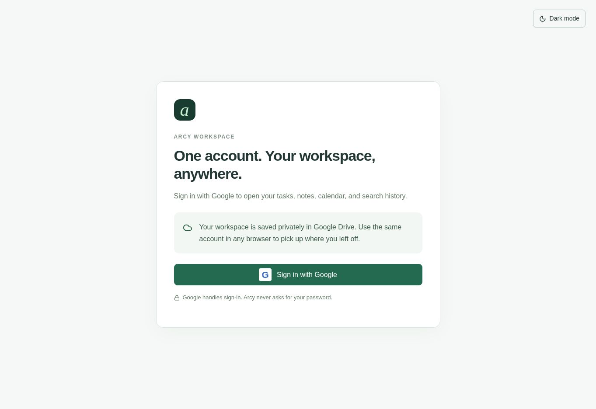
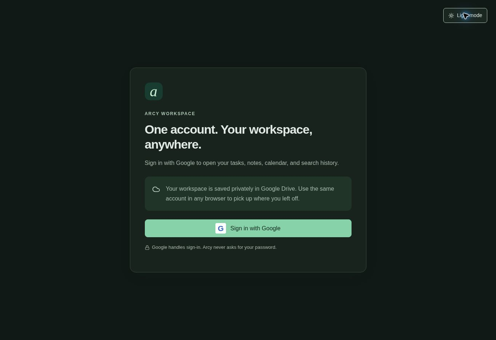

# Arcy Workspace

A personal workspace for tasks, notes, calendar events, and searchable work context. Sign in with Google and continue with the same workspace in another browser.

**[Open Arcy Workspace](https://yujism.github.io/arcy-workspace/docs/)** · [Google setup](GOOGLE_SETUP.md) · [Design guidelines](DESIGN.md)

## Persistent sign-in on Vercel

The new [Vercel deployment](https://arcy-workspace.vercel.app/) includes encrypted HttpOnly session cookies, automatic token renewal, and a rolling 30-day session. **Activation is pending the Google OAuth client secret and callback configuration**; follow [Vercel setup](VERCEL_SETUP.md). The GitHub Pages edition below keeps its existing login flow. Workspace data continues to use the same Google account and OAuth client.

## Screenshots

Real captures of the deployed sign-in screen in light and dark mode. These screenshots show the public entry screen; they do not show an authenticated dashboard or private workspace data.

### Light mode



### Dark mode



## Current development status

The live application is the **GitHub Pages edition**. Its React frontend calls Google APIs from the browser, and saves workspace records to Google Drive's private application-data area. Google sign-in, account-based workspace storage, task and note management, calendar tools, source search, theme switching, and collapsible navigation are implemented.

| Recent update | Current behavior |
| --- | --- |
| Google sign-in | Opens the workspace associated with the selected Google account. |
| Cross-browser workspace | Sign into the same Google account to retrieve saved records. |
| English interface | Pages UI labels, dialogs, notifications, and built-in search messages use English. User content stays in its original language. |
| Cleaner navigation | Sync now, Sign out, and the theme switch live in the left sidebar. |
| Sidebar toggle | Collapse or reopen the sidebar from the header; the desktop preference is remembered in that browser. |
| Light and dark mode | Follows device appearance until an explicit preference is saved. Available on sign-in and inside the workspace. |
| Backup controls | Export backup and Import backup buttons have been removed from the interface. |
| Taste design guidance | Restrained green accents, consistent spacing and corners, and light/dark styling. |
| Ponytail coding guidance | Full mode: reuse existing code and native features, avoid unnecessary dependencies, and remove unused code. |

## Features

### 1. Google account and workspace sync

Choose **Sign in with Google** to authorize app-data storage and open your workspace. Tasks, notes, saved calendar records, and question/search history belong to that Google account.

- Saves are confirmed by Google Drive before the application reports success.
- A visible open tab refreshes every 30 seconds, and refreshes on focus or reconnection. **Sync now** requests a manual refresh.
- Separate operation records preserve changes across browsers, including deletions. Stale edits are rejected when a newer version is detected; reopen the item before editing again.
- **Sign out** closes the local session without deleting the workspace in Drive. **Disconnect** in Connections revokes Google access and closes the workspace; reload to sign in again.
- If this browser contains records from the original local-storage edition, **Move to this account** offers a confirmed copy into the signed-in account. The original local data is retained; Google sources belonging to other accounts are skipped.

This is periodic synchronization while the app is open, not realtime collaboration or an offline-first app. Internet access is required to load and save the cloud workspace.

### 2. Home

A starting point for the day's work:

- **Ask Arcy** composer and suggested questions.
- Open-task count and overdue-task count.
- Today's saved agenda and a week strip that opens a selected calendar day.
- **Focus list** with up to four open tasks and shortcuts to add or complete tasks.
- Recent knowledge sources and shortcuts to create notes or connect Google services.

The dashboard summarizes records already in the workspace. Import or sync Google sources to update that context.

### 3. Tasks

Create, edit, complete, reopen, and delete tasks. Each task has a title, optional notes, an optional due date, and a **High**, **Medium**, or **Low** priority.

Use **Open**, **Completed**, or **All** filters and text search. The Tasks page orders items by due date. Tasks can also start as drafts from a knowledge source or an Ask Arcy response, carrying relevant context into the editor.

### 4. Knowledge

Keep personal notes alongside imported Google source snapshots.

- Create and edit notes with a title, content, and tag.
- Filter by **All sources**, **My notes**, or **Google**; search titles and content.
- Open a note to read its content, saved date, and source information.
- Follow **Open source** to the original Google document or spreadsheet.
- Use **Create task** to turn a source into a task draft.
- Delete a snapshot from Arcy without deleting the original Google file.

### 5. Ask Arcy

The live Pages edition provides **keyword-based source search** across saved tasks, notes, and events. Matching titles receive more weight than body matches; brief/follow-up prompts also prioritize open tasks and today's events. Results include numbered source references that can be opened from the conversation.

Questions and search responses are saved to the workspace, and **Create task** turns a response into a task draft. If no source matches, Arcy asks for more context instead of inventing an answer.

**Generative AI is not enabled in the Pages edition.** The retained server implementation can produce grounded AI answers after separate deployment and secret configuration. A suggested daily-brief prompt is an on-demand search action, not a scheduled notification.

### 6. Calendar

View saved events by day in **Asia/Jakarta (WIB)**, use the date picker, move to the previous/next day, or return to **Today**.

- Create, edit, and delete local Arcy events with a title, notes, start time, and end time.
- Display synced Google events alongside local events, with source labels and all-day support.
- **Sync Google** imports events from the primary Google calendar for the past 30 days through the next six months. The Pages connector requests expanded recurring occurrences for this window.
- **Send to Google** opens a preview. **Approve & send** creates the local event in the primary Google calendar without inviting guests. Additional Calendar write permission is requested when needed.
- Deterministic event IDs prevent duplicate creation on retries. Edit imported Google events in Google Calendar; removing an Arcy snapshot does not delete the original event.

Workspace refresh and Google Calendar import are separate operations. Use the Calendar sync action to refresh imported events.

### 7. Connections

Authorize only the services you need, inspect their connection status, manage permissions, or disconnect Google.

| Connection | What it does | How to use it |
| --- | --- | --- |
| Google Drive | Searches Google Docs by title and imports selected documents as plain-text snapshots. Re-importing updates the same source. | Open Connections, connect Drive, then Browse documents. |
| Google Sheets | Reads an explicit A1 range and saves its displayed values, range, and source URL. It does not write to the spreadsheet. | Choose Import a range, enter a spreadsheet URL or ID and a range such as `'Planning'!A1:H50`. |
| Google Calendar | Imports events from the primary calendar and can publish reviewed local events. | Connect Calendar, then use Sync calendar or the Calendar page. |
| Arcy intelligence | Shows AI configuration status and setup information. | The live Pages build remains in source-search mode; AI requires a separately configured backend. |

Google authorization is separate from ChatGPT's connectors. Arcy does not automatically inherit a connected ChatGPT account or its permissions.

### 8. Appearance and navigation

- **Light/Dark mode:** switch in the sign-in screen or sidebar. Explicit preferences are remembered in the browser and shared between tabs of the same origin.
- **Collapsible sidebar:** use the header toggle or **Ctrl/Cmd+B**. On smaller screens, navigation opens as a drawer.
- **Sidebar controls:** view sync status, refresh the workspace, switch appearance, or sign out.
- **Responsive interface:** layouts adapt to smaller screens; reduced-motion preferences are respected.
- **English UI:** navigation, forms, messages, and help in the live Pages edition use English. Imported documents and existing records are not automatically translated.

## Getting started

1. Open the [live app](https://yujism.github.io/arcy-workspace/docs/).
2. Sign in with Google and allow app-data storage. For a new deployment, complete [Google setup](GOOGLE_SETUP.md) first.
3. Add a task or note to populate Home.
4. Open Connections and authorize Drive, Sheets, or Calendar as needed.
5. Import a document or range, or sync your calendar.
6. Ask Arcy about the saved sources. Use the same Google account in another browser to continue.

## Scope and limits

| Area | Current limit |
| --- | --- |
| Workspace | Up to 5,000 records, including saved conversations; up to 20,000 operation-history entries. |
| Individual save | Up to 4,000,000 bytes per sync operation. |
| Document / Sheets import | Up to 100,000 characters per imported source. |
| Drive browsing | Up to 30 recent matching Google Docs per search. Refine the title to find other documents. |
| Calendar import | Primary calendar only; date window above; at most 20 pages of up to 250 events per sync. |
| Source freshness | Docs and Sheets are on-demand snapshots. Calendar imports require their own sync action. |
| AI | Pages provides text search, not LLM answers, embeddings, semantic search, or hybrid search. |
| Automation | No scheduled briefs, background jobs when the app is closed, or automatic Drive-wide import. |
| File types | Google Docs and Sheets ranges are supported; PDF parsing is not implemented. |
| Offline / collaboration | No offline save queue or shared multi-user workspace. |

## Development

### Stack and layout

| Path | Purpose |
| --- | --- |
| `app/workspace.tsx` | Shared React workspace UI. |
| `components/` | UI primitives and Google connection controls. |
| `pages/` | GitHub Pages entry, browser Google authorization/API adapters, Drive storage, and theme styles. |
| `docs/` | Generated production assets served by GitHub Pages. |
| `app/api/`, `lib/`, `db/` | Retained server implementation using Vinext/Next.js-compatible routes and D1/SQLite. Not executed by Pages. |
| `tests/` | Mocked storage, authorization, connector, and server checks. |
| `documentation/screenshots/` | Actual public-app screenshots used by this README. |
| `.agents/skills/`, `AGENTS.md`, `DESIGN.md` | Taste and Ponytail guidance for future development. |

The Pages build uses React 19, TypeScript, Vite, Tailwind CSS 4, shadcn-style UI components, Lucide icons, and Zod validation. Google Drive supplies account-specific persistence; Pages itself only hosts static assets.

### Run the Pages frontend locally

Use Node.js **22.13 or later** and the pnpm version pinned in `package.json`.

```bash
pnpm install --frozen-lockfile
pnpm exec vite --config pages/vite.config.ts --host 127.0.0.1
```

Register the local origin in your Google OAuth configuration before testing sign-in. See [GOOGLE_SETUP.md](GOOGLE_SETUP.md). OAuth client IDs identify the application; client secrets and API keys must never be bundled into frontend code.

### Build and verify

```bash
node node_modules/typescript/bin/tsc --noEmit
pnpm build:pages
```

The build verifies that generated relative asset links resolve. Existing integration checks are available through:

```bash
node tests/drive-workspace.mjs
node tests/google-pages.mjs
node tests/api.mjs
```

These checks use mocked Google responses or substituted server identities and do not prove live OAuth or provider access. TypeScript and the Pages production build passed for the recent UI and Ponytail updates. This README update verifies the public sign-in screen in both themes; authenticated feature behavior is documented from the implementation, not from a fresh end-to-end login test.

### Publish

Commit source changes together with the rebuilt `docs/`. GitHub Pages can serve **main /docs**, or **main /(root)** using the repository's redirect to `docs/`. Confirm the Pages deployment succeeds before treating an update as live. See the [deployment history](https://github.com/yujism/arcy-workspace/actions).

### Optional server edition

The original server build is retained for separate hosting. It uses platform-managed authenticated identity and D1/SQLite rather than the Pages account-storage flow. Its Google connector uses server OAuth credentials, and its AI route requires `OPENAI_API_KEY` with optional `OPENAI_MODEL`. Runtime secrets belong in server configuration; see [`.env.example`](.env.example) and [Google setup](GOOGLE_SETUP.md).

Deploying static assets on GitHub Pages does not activate these API routes, D1 storage, or AI responses. The legacy server path also retains older copy and connector behavior; the current English UI and browser-based Google flow described above refer to the live Pages edition.

## Development principles

[Taste Skill](https://github.com/Leonxlnx/taste-skill) guides relevant visual refinements. [Ponytail](https://github.com/DietrichGebert/ponytail) runs in full mode for implementation: reuse what exists, prefer native browser features, and keep the smallest working change while preserving validation, data-loss protection, security, and accessibility. Both are development instructions, not runtime AI features.
